# CSS-Battle-SVG
Turning CSS Battle targets into SVGs

More info on CSS Battle at https://cssbattle.dev
---

# Battle #1 - Pilot Battle
## 1. Simply Square
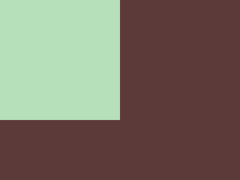

## 2. Carrom
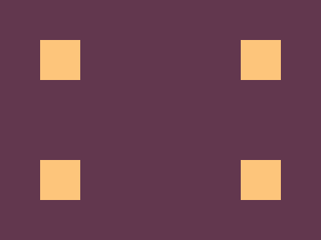

## 3. Push Button
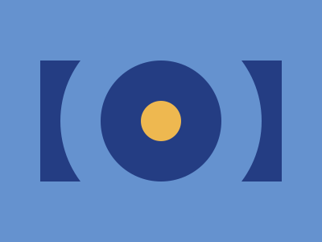

## 4. Ups n Downs
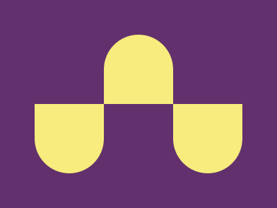

## 5. Acid Rain
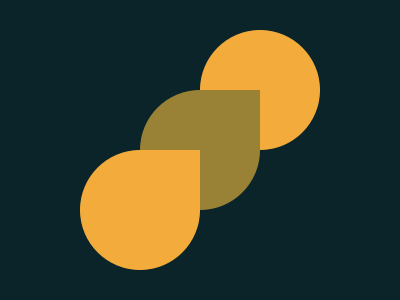

## 6. Missing Slice

## 7. Leafy Trail
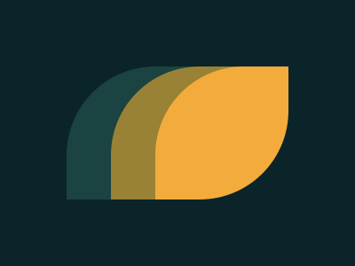

## 8. Forking Crazy
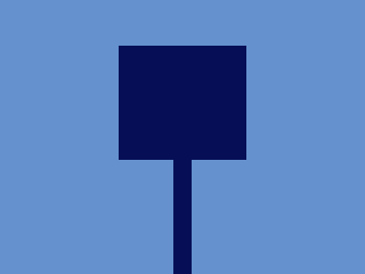

## 9. Tesseract
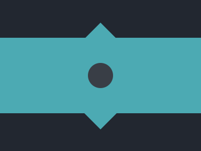

## 10. Cloaked Sprits
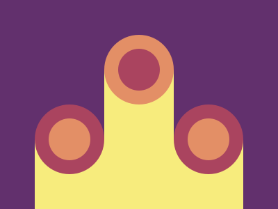

## 11. Eye of Sauron
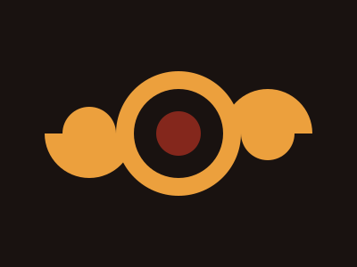

## 12. Wiggly Mustache
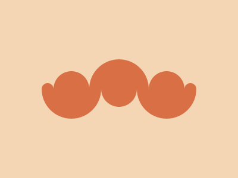

# Battle #2 - Visibility
## 13. Totally Triangle

## 14. Web Maker Logo
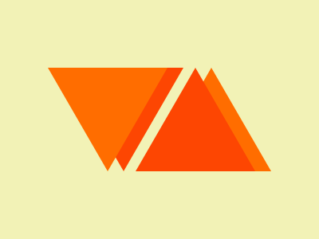

## 15. Overlap
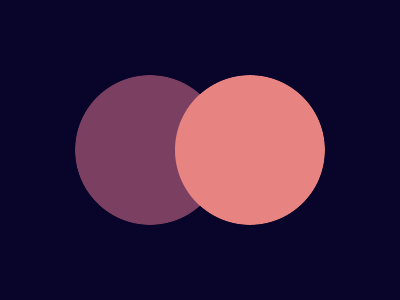

## 16. Eye of the Tiger
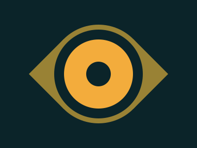

## 17. Fidget Spinner
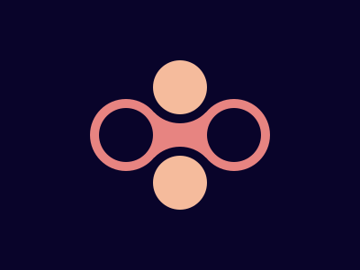

## 18. Matrix
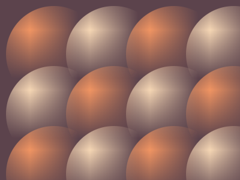

# Battle #3 - Cursor
## 19. Cube
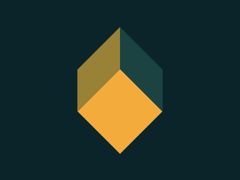

## 20. Ticket
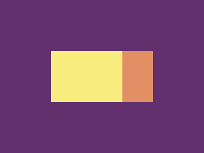
More coming soon!
