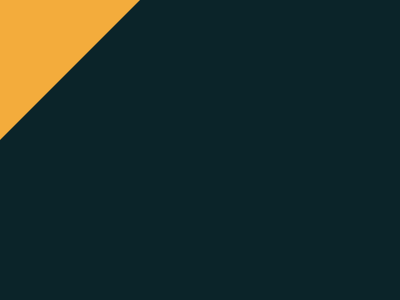

# CSS-Battle-SVG
Turning CSS Battle targets into SVGs

More info on CSS Battle at https://cssbattle.dev
---

# Battle #1 - Pilot Battle
## 1. Simply Square

## 2. Carrom

## 3. Push Button

## 4. Ups n Downs

## 5. Acid Rain

## 6. Missing Slice

## 7. Leafy Trail

## 8. Forking Crazy

## 9. Tesseract

## 10. Cloaked Sprits

## 11. Eye of Sauron

## 12. Wiggly Mustache

# Battle #2 - Visibility
## 1. Totally Triangle

## 2. Web Maker Logo

## 3. Overlap

## 4. Eye of the Tiger

More coming soon!
